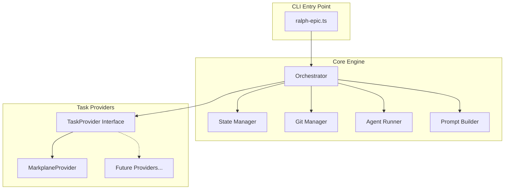

# Plan 01: TypeScript Implementation with Markplane Provider

## Overview

Migrate the existing [`markplane-ralph-epic`](../markplane-ralph-epic:1) bash script to a TypeScript implementation with a modular provider architecture. The initial implementation will replicate all existing functionality using a `MarkplaneProvider` and pass all existing tests.

## Architecture



## Key Interfaces

```typescript
// Core types
interface Epic {
  id: string;
  name: string;
  dependsOn?: string;
  status: 'pending' | 'in-progress' | 'done';
}

interface Task {
  id: string;
  epicId: string;
  name: string;
  status: 'pending' | 'in-progress' | 'done';
  acceptanceCriteria?: string[];
}

// Provider interface - the abstraction that enables multiple sources
interface TaskProvider {
  // Discovery
  listEpics(): Promise<Epic[]>;
  getEpicTasks(epicId: string): Promise<Task[]>;
  
  // Status updates
  setEpicStatus(epicId: string, status: Epic['status']): Promise<void>;
  setTaskStatus(taskId: string, status: Task['status']): Promise<void>;
  
  // Sync
  sync(): Promise<void>;
  
  // Provider-specific prompt instructions
  getDiscoveryInstructions(): string;
  getWorkInstructions(epic: Epic): string;
}
```

## Directory Structure

```
ralph/
├── src/
│   ├── index.ts                 # CLI entry point
│   ├── cli.ts                   # Argument parsing
│   ├── orchestrator.ts          # Main loop logic
│   ├── state-manager.ts         # .ralph-epic-state handling
│   ├── git-manager.ts           # Git operations
│   ├── agent-runner.ts          # Execute agent commands
│   ├── prompt-builder.ts        # Build prompts for agents
│   ├── types.ts                 # Shared type definitions
│   └── providers/
│       ├── index.ts             # Provider factory
│       ├── task-provider.ts     # TaskProvider interface
│       └── markplane.ts         # MarkplaneProvider implementation
├── tests/
│   ├── unit/
│   │   ├── orchestrator.test.ts
│   │   ├── state-manager.test.ts
│   │   ├── git-manager.test.ts
│   │   └── providers/
│   │       └── markplane.test.ts
│   ├── integration/
│   │   ├── test-ralph-epic.ts   # Port of test-ralph-epic.sh
│   │   └── test-branch-skip.ts  # Port of test-branch-skip.sh
│   └── mocks/
│       └── mock-agent.ts        # Port of mock-agent.sh
├── package.json
├── tsconfig.json
└── README.md
```

---

## Implementation Plan

### Phase 1: Project Setup

- [ ] Initialize npm project with TypeScript configuration
- [ ] Add dependencies: `simple-git`, `commander`, `tsx`
- [ ] Add dev dependencies: `vitest`, `@types/node`, `typescript`
- [ ] Create `tsconfig.json` with strict mode
- [ ] Create bin entry in `package.json` for `ralph-epic` command

### Phase 2: Core Types and Interfaces

- [ ] Create [`src/types.ts`] with `Epic`, `Task`, `Status` types
- [ ] Create [`src/providers/task-provider.ts`] with `TaskProvider` interface
- [ ] Create config type `RalphConfig` for CLI options

### Phase 3: State Management

Port the state file logic from [`markplane-ralph-epic`](../markplane-ralph-epic:135-167):

- [ ] Implement [`src/state-manager.ts`]:
  - [ ] `saveState(epic, branch)` - write `.ralph-epic-state`
  - [ ] `loadState()` - read and parse state file
  - [ ] `clearState()` - remove state file
  - [ ] Use JSON format instead of bash source for safety

### Phase 4: Git Manager

Port git operations from [`markplane-ralph-epic`](../markplane-ralph-epic:169-223):

- [ ] Implement [`src/git-manager.ts`] using `simple-git`:
  - [ ] `sanitizeBranchName(name)` - clean epic name for branch
  - [ ] `setupEpicBranch(epicId, epicName, dependsOn)` - create/checkout branch
  - [ ] `getCurrentBranch()` - get current branch name
  - [ ] `getCompletedEpicBranches(prefix)` - list existing epic branches
  - [ ] `hasUncommittedChanges()` - check for uncommitted work
  - [ ] `commitChanges(message)` - safety commit
  - [ ] `pushBranch(branchName)` - push to origin
  - [ ] `fetchOrigin()` - fetch latest from origin

### Phase 5: Agent Runner

Port agent execution from [`markplane-ralph-epic`](../markplane-ralph-epic:106-127):

- [ ] Implement [`src/agent-runner.ts`]:
  - [ ] `runAgent(prompt, command, logFile?)` - execute agent command
  - [ ] Handle stdout streaming when TTY available
  - [ ] Write to log file if specified
  - [ ] Return output as string
  - [ ] Handle exit codes

### Phase 6: Prompt Builder

Port prompt generation from [`markplane-ralph-epic`](../markplane-ralph-epic:327-491):

- [ ] Implement [`src/prompt-builder.ts`]:
  - [ ] `buildDiscoveryPrompt(completedEpics, provider)` - epic discovery prompt
  - [ ] `buildWorkPrompt(epic, branch, provider)` - task implementation prompt
  - [ ] Accept provider-specific instructions

### Phase 7: Markplane Provider

- [ ] Implement [`src/providers/markplane.ts`]:
  - [ ] `listEpics()` - parse `markplane epic list` output
  - [ ] `getEpicTasks(epicId)` - parse `markplane task list` for epic
  - [ ] `setEpicStatus(id, status)` - run `markplane epic status`
  - [ ] `setTaskStatus(id, status)` - run `markplane task status`
  - [ ] `sync()` - run `markplane sync`
  - [ ] `getDiscoveryInstructions()` - markplane-specific discovery commands
  - [ ] `getWorkInstructions(epic)` - markplane-specific work commands

### Phase 8: Orchestrator (Main Loop)

Port main loop from [`markplane-ralph-epic`](../markplane-ralph-epic:369-555):

- [ ] Implement [`src/orchestrator.ts`]:
  - [ ] Main iteration loop with max iterations
  - [ ] Epic discovery phase (call agent in discovery mode)
  - [ ] Parse agent output for `EPIC_ID`, `EPIC_NAME`, `DEPENDS_ON`
  - [ ] Branch setup before work
  - [ ] Work phase (call agent in work mode)
  - [ ] Detect `EPIC_COMPLETE` signal
  - [ ] Extract `PR_DESCRIPTION` from agent output
  - [ ] Create PR on epic completion
  - [ ] Detect `RALPH_COMPLETE` signal
  - [ ] Safety commit for uncommitted changes
  - [ ] Branch verification after agent runs

### Phase 9: CLI Entry Point

Port argument parsing from [`markplane-ralph-epic`](../markplane-ralph-epic:28-67):

- [ ] Implement [`src/cli.ts`] using `commander`:
  - [ ] `--agent-cmd <cmd>` - agent command (default: claude)
  - [ ] `--max-iterations <n>` - iteration limit (default: 50)
  - [ ] `--branch-prefix <p>` - branch prefix (default: ralph)
  - [ ] `--log-file <path>` - optional log file
  - [ ] `--no-push` - skip push/PR creation
  - [ ] `--no-sleep` - skip delays (for testing)
  - [ ] `<work_dir>` - working directory (default: .)
- [ ] Implement [`src/index.ts`] - wire CLI to orchestrator

### Phase 10: Mock Agent (TypeScript)

Port [`mock-agent.sh`](../mock-agent.sh:1) to TypeScript:

- [ ] Create [`tests/mocks/mock-agent.ts`]:
  - [ ] Detect discovery vs work mode from prompt
  - [ ] Maintain state in `.mock-agent-state`
  - [ ] Return epic info in discovery mode
  - [ ] Create files and commit in work mode
  - [ ] Signal `EPIC_COMPLETE` and `RALPH_COMPLETE`
- [ ] Make it executable via shebang + tsx

### Phase 11: Unit Tests

- [ ] Create [`tests/unit/state-manager.test.ts`]:
  - [ ] Test save/load/clear state
  - [ ] Test JSON parsing edge cases
- [ ] Create [`tests/unit/git-manager.test.ts`]:
  - [ ] Test branch name sanitization
  - [ ] Test completed branch detection
  - [ ] Mock simple-git for unit tests
- [ ] Create [`tests/unit/providers/markplane.test.ts`]:
  - [ ] Mock markplane CLI output
  - [ ] Test parsing of epic/task lists

### Phase 12: Integration Tests

Port existing bash tests:

- [ ] Create [`tests/integration/test-ralph-epic.ts`]:
  - [ ] Port from [`test-ralph-epic.sh`](../test-ralph-epic.sh:1)
  - [ ] Create temp git repo
  - [ ] Run with mock agent
  - [ ] Verify branches and commits created
- [ ] Create [`tests/integration/test-branch-skip.ts`]:
  - [ ] Port from [`test-branch-skip.sh`](../test-branch-skip.sh:1)
  - [ ] TEST 1: Epic with branch should be skipped
  - [ ] TEST 2: STATE_FILE epic excluded from skip list
  - [ ] TEST 3: All epics with branches = RALPH_COMPLETE
  - [ ] TEST 4: Max iterations reached gracefully

### Phase 13: Documentation

- [ ] Update README.md with:
  - [ ] Installation instructions
  - [ ] Usage examples
  - [ ] Provider architecture explanation
  - [ ] How to add new providers

---

## Test Compatibility Matrix

| Bash Test | TypeScript Equivalent | Key Assertions |
|-----------|----------------------|----------------|
| [`test-ralph-epic.sh`](../test-ralph-epic.sh:47-57) | `test-ralph-epic.ts` | Branches created, commits made, files generated |
| [`test-branch-skip.sh`](../test-branch-skip.sh:34-97) TEST 1 | `test-branch-skip.ts` | EPIC-001 skipped when branch exists |
| [`test-branch-skip.sh`](../test-branch-skip.sh:102-201) TEST 2 | `test-branch-skip.ts` | STATE_FILE epic not in skip list |
| [`test-branch-skip.sh`](../test-branch-skip.sh:205-257) TEST 3 | `test-branch-skip.ts` | All branches = RALPH_COMPLETE |
| [`test-branch-skip.sh`](../test-branch-skip.sh:262-311) TEST 4 | `test-branch-skip.ts` | Max iterations no errors |

## Signals to Preserve

These signals must work identically:

| Signal | Purpose | Location |
|--------|---------|----------|
| `RALPH_COMPLETE` | All epics done | [`markplane-ralph-epic`](../markplane-ralph-epic:74) |
| `EPIC_COMPLETE` | Current epic done | [`markplane-ralph-epic`](../markplane-ralph-epic:75) |
| `PR_DESCRIPTION_START/END` | PR body from agent | [`markplane-ralph-epic`](../markplane-ralph-epic:479-482) |
| `EPIC_ID:` | Discovery output | [`markplane-ralph-epic`](../markplane-ralph-epic:351) |
| `EPIC_NAME:` | Discovery output | [`markplane-ralph-epic`](../markplane-ralph-epic:352) |
| `DEPENDS_ON:` | Discovery output | [`markplane-ralph-epic`](../markplane-ralph-epic:353) |

## Success Criteria

- [ ] All 4 tests from [`test-branch-skip.sh`](../test-branch-skip.sh:1) pass
- [ ] Full workflow from [`test-ralph-epic.sh`](../test-ralph-epic.sh:1) works
- [ ] CLI arguments behave identically to bash version
- [ ] State file compatible (or cleanly migrated)
- [ ] Git branch naming identical
- [ ] PR creation works (when gh available)
