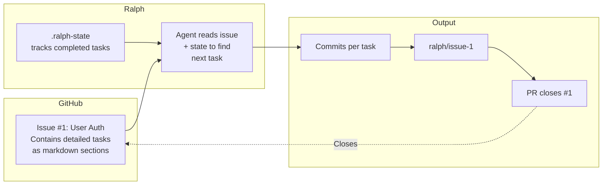
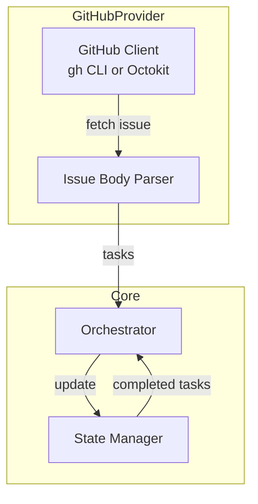

# Plan 02: GitHub Provider Implementation

## Overview

Implement a `GitHubProvider` that sources epics and tasks from GitHub Issues. Each issue is a self-contained epic with detailed task descriptions in the body. Progress is tracked externally (via commits and internal state), not via checkboxes in GitHub.

## MCP vs CLI Approach

| Provider | Integration Method | Why |
|----------|-------------------|-----|
| Markplane | MCP Server | Markplane provides an MCP server for structured tool access |
| GitHub | `gh` CLI + Prompts | `gh` CLI is ubiquitous, well-documented, and the agent can use it directly via shell commands |

**For GitHub, we don't need an MCP server.** Instead, we provide clear prompt instructions that teach the agent how to use `gh` CLI commands. This is simpler and leverages existing tooling.

## Design Philosophy

### Key Insight

Sub-issues and checkboxes are unnecessary because:
1. All tasks in an epic are resolved together when the PR is merged
2. Individual task status updates in GitHub would be noise
3. The agent needs detailed, self-contained task descriptions for fresh context each iteration

### Approach: Self-Contained Issue Bodies



## Issue Format

Each GitHub Issue serves as an epic with self-contained task descriptions:

```markdown
---
depends_on: 
---

# User Authentication System

## Overview
Implement secure user authentication with email/password login.

## Technical Context
- Framework: Next.js 14 with App Router
- Database: PostgreSQL with Prisma
- Auth library: NextAuth.js v5

---

## Task 1: Create Login Page UI

### Description
Build the login page with email and password fields, styled with Tailwind CSS.

### Requirements
- Create `app/login/page.tsx`
- Include email input with validation
- Include password input with show/hide toggle
- Add "Forgot password" link
- Add "Sign up" link for new users

### Acceptance Criteria
- Page renders at /login
- Form validates email format client-side
- Password field masks input by default
- Responsive design (mobile-first)

### Technical Notes
- Use React Hook Form for form state
- Use Zod for validation schema

---

## Task 2: Implement Login API Endpoint

### Description
Create the server-side authentication endpoint.

### Requirements
- Create `app/api/auth/login/route.ts`
- Validate credentials against database
- Return JWT token on success
- Return appropriate error codes on failure

### Acceptance Criteria
- POST /api/auth/login accepts {email, password}
- Returns 200 with token on valid credentials
- Returns 401 on invalid credentials
- Returns 400 on malformed request

### Technical Notes
- Hash comparison with bcrypt
- JWT expiration: 24 hours

---

## Task 3: Add Session Management

### Description
Implement session persistence and middleware.

### Requirements
- Store session in HTTP-only cookie
- Create auth middleware for protected routes
- Add logout endpoint

### Acceptance Criteria
- Session persists across page reloads
- Protected routes redirect to /login if unauthenticated
- Logout clears session cookie

---

## Dependencies
None - this is the first epic.

## Acceptance Criteria (Epic Level)
- Users can register, log in, and log out
- Protected routes are inaccessible without auth
- Session persists across browser sessions
```

## How Task Progress Is Tracked

Since we don't use checkboxes, task progress is tracked in the **local state file**:

```json
{
  "epic": {
    "id": "1",
    "name": "User Authentication System",
    "issueNumber": 1
  },
  "completedTasks": ["Task 1", "Task 2"],
  "currentTask": "Task 3",
  "branch": "ralph/issue-1-user-authentication"
}
```

The agent:
1. Reads the issue body to get all task descriptions
2. Checks state file for completed tasks
3. Works on the first incomplete task
4. Updates state file on commit
5. Signals `EPIC_COMPLETE` when all tasks done

## Architecture



## Directory Structure

```
ralph/
└── src/
    └── providers/
        └── github/
            ├── index.ts           # GitHubProvider class
            ├── issue-parser.ts    # Parse issue body into tasks
            ├── client.ts          # gh CLI wrapper
            └── types.ts           # GitHub-specific types
```

---

## Implementation Plan

### Phase 1: Issue Parser

- [ ] Create [`src/providers/github/issue-parser.ts`]:
  - [ ] Parse frontmatter for `depends_on`
  - [ ] Split body by `## Task N:` headers
  - [ ] Extract task sections with full content
  - [ ] Return array of `Task` objects with:
    - `id`: "Task 1", "Task 2", etc.
    - `name`: Title after "Task N:"
    - `description`: Full section content
    - `acceptanceCriteria`: Parsed from "### Acceptance Criteria"

### Phase 2: GitHub Client (gh CLI)

- [ ] Create [`src/providers/github/client.ts`]:
  - [ ] `listIssues(label)` - list issues with label
  - [ ] `getIssue(number)` - get single issue with body
  - [ ] `getIssueState(number)` - check open/closed
  - [ ] `closeIssue(number)` - close when epic complete
  - [ ] Use `gh` CLI for simplicity (no npm deps)

```typescript
async function listIssues(label: string): Promise<GitHubIssue[]> {
  const output = await exec(
    `gh issue list --label "${label}" --json number,title,body,state --limit 100`
  );
  return JSON.parse(output);
}

async function getIssue(number: number): Promise<GitHubIssue> {
  const output = await exec(
    `gh issue view ${number} --json number,title,body,state`
  );
  return JSON.parse(output);
}
```

### Phase 3: GitHub Provider

- [ ] Create [`src/providers/github/index.ts`]:

```typescript
class GitHubProvider implements TaskProvider {
  constructor(private config: GitHubProviderConfig) {}
  
  async listEpics(): Promise<Epic[]> {
    const issues = await listIssues(this.config.epicLabel);
    return issues.map(issue => ({
      id: String(issue.number),
      name: issue.title,
      dependsOn: this.parseDependsOn(issue.body),
      status: issue.state === 'open' ? 'pending' : 'done',
      issueNumber: issue.number,
      body: issue.body
    }));
  }
  
  async getEpicTasks(epicId: string): Promise<Task[]> {
    const issue = await getIssue(parseInt(epicId));
    return parseTasksFromBody(issue.body);
  }
  
  async setEpicStatus(epicId: string, status: Status): Promise<void> {
    if (status === 'done') {
      await exec(`gh issue close ${epicId}`);
    }
    // Note: no need to reopen - we don't track "in-progress" in GitHub
  }
  
  async setTaskStatus(taskId: string, status: Status): Promise<void> {
    // No-op - task status tracked in local state file
    // taskId is just for interface compatibility
  }
  
  async sync(): Promise<void> {
    // No-op - no external sync needed
  }
  
  getDiscoveryInstructions(): string {
    return `Find the next epic to work on:
1. Use gh CLI: gh issue list --label ${this.config.epicLabel}
2. Check which epics have open issues
3. Verify dependencies are satisfied (closed issues)
4. Report the first available epic`;
  }
  
  getWorkInstructions(epic: Epic): string {
    return `Working on Issue #${epic.id}: ${epic.name}

Read the issue body for detailed task descriptions.
Each task is a ## Task N: section with full requirements.

Work on ONE task per iteration:
1. Read the task's Description, Requirements, and Acceptance Criteria
2. Implement the task
3. Verify acceptance criteria
4. Commit with: git add . && git commit -m "feat(#${epic.id}): <task summary>"

When ALL tasks are complete:
- Signal: EPIC_COMPLETE
- The PR will automatically close Issue #${epic.id}`;
  }
}
```

### Phase 4: State Manager Enhancement

- [ ] Update [`src/state-manager.ts`] to track completed tasks:
  - [ ] Add `completedTasks: string[]` to state
  - [ ] Add `markTaskComplete(taskId)` method
  - [ ] Add `getCompletedTasks()` method
  - [ ] Add `getNextIncompleteTask(allTasks)` method

### Phase 5: Orchestrator Integration

- [ ] Update orchestrator to:
  - [ ] Fetch epic's full task list from provider
  - [ ] Compare against completed tasks in state
  - [ ] Include only the next incomplete task in work prompt
  - [ ] Update state when task committed

### Phase 6: PR Creation Enhancement

- [ ] Update PR creation to include:
  - [ ] `Closes #X` to auto-close the issue
  - [ ] Copy epic's acceptance criteria to PR body
  - [ ] List all completed tasks

```typescript
async function createPR(epic: Epic, branch: string, tasks: Task[]): Promise<void> {
  const body = `## ${epic.name}

Closes #${epic.id}

### Completed Tasks
${tasks.map(t => `- ${t.name}`).join('\n')}

### Acceptance Criteria
${epic.acceptanceCriteria}

---
*Automated PR by Ralph*`;

  await exec(`gh pr create --base main --head ${branch} --title "feat: ${epic.name}" --body '${body}'`);
}
```

### Phase 7: Configuration

- [ ] Add GitHub config options:

```typescript
interface GitHubProviderConfig {
  epicLabel: string;  // default: "epic"
}
```

- [ ] CLI flags:
  - [ ] `--provider github`
  - [ ] `--github-label <label>` (default: "epic")

### Phase 8: Unit Tests

- [ ] Create [`tests/unit/providers/github/issue-parser.test.ts`]:
  - [ ] Test parsing task sections
  - [ ] Test frontmatter extraction
  - [ ] Test edge cases (no tasks, malformed headers)
- [ ] Create [`tests/unit/providers/github/client.test.ts`]:
  - [ ] Mock `exec` calls
  - [ ] Test JSON parsing
  - [ ] Test error handling

### Phase 9: Integration Tests

- [ ] Create test GitHub issues in a test repo
- [ ] Run full workflow with mock agent
- [ ] Verify:
  - [ ] Issue is closed when epic complete
  - [ ] PR references issue correctly
  - [ ] Branch naming follows pattern

---

## Agent Prompts: Teaching `gh` CLI Usage

Since GitHub doesn't have an MCP server like Markplane, we teach the agent how to use `gh` CLI through detailed prompt instructions. The prompts include a reference section so the agent knows the available commands.

### gh CLI Reference (Embedded in Prompts)

This reference is included in prompts so the agent can interact with GitHub:

```markdown
## GitHub CLI Quick Reference

### List Issues by Label
gh issue list --label <label> --json number,title,state,body --limit 100

### View Single Issue
gh issue view <number> --json number,title,body,state

### Check Issue State Only
gh issue view <number> --json state --jq '.state'

### Close Issue
gh issue close <number>

### Create PR That Auto-Closes Issue
gh pr create --base main --head <branch> \
  --title "feat: <title>" \
  --body "Closes #<number>

<PR body content>"
```

### Discovery Prompt (Finding Next Epic)

```
You are discovering the next epic to work on from GitHub Issues.

## GitHub CLI Commands Available
- List epics: gh issue list --label epic --json number,title,state,body
- View issue: gh issue view <N> --json number,title,body,state
- Check if closed: gh issue view <N> --json state --jq '.state'

## Your Task
1. List all issues labeled 'epic'
2. For each OPEN issue, read its body to find 'depends_on:' in the frontmatter
3. An epic is AVAILABLE if:
   - Its state is OPEN
   - It has NO depends_on, OR the depends_on issue is CLOSED
4. Select the FIRST available epic (lowest issue number)

## Required Output Format
Output ONLY these three lines (nothing else):
   EPIC_ID: <issue_number>
   EPIC_NAME: <issue_title>
   DEPENDS_ON: <depends_on_issue_number or empty>

If ALL epic issues are CLOSED, output ONLY:
   RALPH_COMPLETE

DO NOT make any code changes or commits during discovery.
```

### Work Prompt (Implementing Task)

```
You are implementing a task for GitHub Issue #5: User Authentication

## GitHub CLI Commands Available
- View full issue body: gh issue view 5 --json body --jq '.body'
- Close issue when epic done: gh issue close 5

## Current Task
Task 2: Implement Login API Endpoint

## Task Details (from issue body)
### Description
Create the server-side authentication endpoint.

### Requirements
- Create `app/api/auth/login/route.ts`
- Validate credentials against database
- Return JWT token on success
- Return appropriate error codes on failure

### Acceptance Criteria
- POST /api/auth/login accepts {email, password}
- Returns 200 with token on valid credentials
- Returns 401 on invalid credentials
- Returns 400 on malformed request

### Technical Notes
- Hash comparison with bcrypt
- JWT expiration: 24 hours

## Instructions
1. Implement ALL the requirements listed above
2. Verify each acceptance criterion passes
3. Commit your changes:
   git add . && git commit -m "feat(#5): implement login API endpoint"

## On Completion
If this is the LAST task in the epic, output:
   EPIC_COMPLETE

Otherwise, just complete the commit and end your response.
```

### PR Creation Prompt

```
Create a Pull Request for the completed epic.

## GitHub CLI Command
gh pr create --base main --head ralph/issue-5-user-authentication \
  --title "feat: User Authentication System" \
  --body "## Summary
Implements user authentication as specified in Issue #5.

Closes #5

## Completed Tasks
- Task 1: Create Login Page UI
- Task 2: Implement Login API Endpoint
- Task 3: Add Session Management

## Acceptance Criteria
All epic-level acceptance criteria have been met:
- Users can log in with email/password
- Protected routes redirect to /login if unauthenticated
- Session persists across browser sessions

---
*Automated PR by Ralph*"
```

---

## Task Detection Logic

Since tasks are just markdown sections, detection is simpler:

```typescript
function parseTasksFromBody(body: string): Task[] {
  const tasks: Task[] = [];
  
  // Split by "## Task N:" pattern
  const taskPattern = /## Task (\d+):\s*(.+?)(?=## Task \d+:|## Dependencies|$)/gs;
  
  let match;
  while ((match = taskPattern.exec(body)) !== null) {
    const taskNumber = match[1];
    const taskContent = match[2];
    
    tasks.push({
      id: `Task ${taskNumber}`,
      name: extractTitle(taskContent),
      content: taskContent,
      description: extractSection(taskContent, 'Description'),
      acceptanceCriteria: extractSection(taskContent, 'Acceptance Criteria'),
    });
  }
  
  return tasks;
}
```

---

## Comparison: Markplane vs GitHub Provider

| Aspect | Markplane | GitHub |
|--------|-----------|--------|
| Epic source | markplane CLI | GitHub Issues |
| Task source | markplane CLI | Issue body sections |
| Status tracking | markplane sync | Local state file |
| Dependencies | Markplane metadata | Issue frontmatter |
| Completion signal | markplane status | Close issue via gh |
| PR linking | Manual | Auto via "Closes #X" |

---

## Success Criteria

- [ ] Can list epics from GitHub issues with specified label
- [ ] Can parse tasks from issue body `## Task N:` sections
- [ ] Task progress tracked in local state (not in GitHub)
- [ ] Dependencies parsed from frontmatter
- [ ] PR auto-closes issue with `Closes #X`
- [ ] Works with `gh` CLI (no API token required if logged in)
- [ ] All existing orchestrator tests pass
